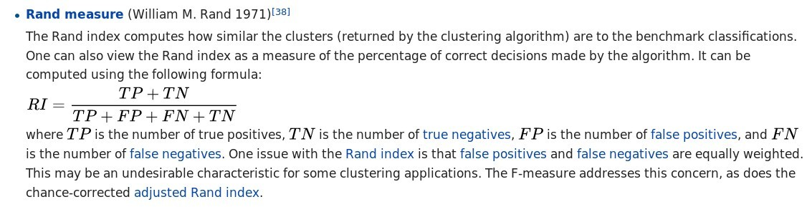

```{r setup, include=FALSE}
knitr::opts_chunk$set(cache=TRUE)
knitr::opts_chunk$set(unnamed.chunk.label = "B")
```

# Intro & basic concepts

## An illustration with 2D synthetic data

OK. Let us first play with a very simple 2D data set created by us by sampling from two identical normal (=Gaussian) distributions with centres displaced.

```{r }
library("mvtnorm")
set.seed(10)
setA <- rmvnorm(1000,c(0,0),matrix(c(1,0,0,1),2,2))
setB <- rmvnorm(1000,c(3,3),matrix(c(1,0,0,1),2,2))
mock.data <- rbind(setA,setB)
plot(mock.data)

```

## The k-means algorithm

$K$-means is a very popular and simple iterative algorithm for clustering. Let us learn its steps with the very simple 2 cluster 2D problem.

We start by randomly selecting two points that we will take as starting solution.

```{r }
rc <- sample(1:dim(mock.data)[1],2)
plot(mock.data)
points(mock.data[rc,],pch=16,col="seagreen",cex=2)
```

We will then take this two points as the centres of the two clusters. We could have tried three or more clusters.

If these two points are the centres of the two clusters, each cluster will be made up of the points that are closer to each centre. Closer is a word that implies many things. In particular, it implies a distance and a metric. In the following, I will assume that the metric is Euclidean, but you have various choices (Euclidean, Manhattan, L$_\infty$) that you should consider before applying (most) clustering algorithms. 

A quote from [Elements of Statistical Learning](https://web.stanford.edu/~hastie/ElemStatLearn/)

"An appropriate dissimilarity measure is far more important in obtaining success with clustering than choice of clustering algorithm. This aspect of the problem ... depends on domain specific knowledge and is less amenable to general research."

If you decide to use the euclidean distance, take into account its definition:

$d(\mathbb{x},\mathbb{y}) = \sqrt(\sum_i^n (x_i-y_i)^2)$

If dimension $i$ has a range between 0 and, say, $10^6$ while dimension $j$ only goes from 0 to 1, differences in $i$ will dominate the distance even if they only reflect noise.

Also, the choice of metric dictates the position of the centres, as we shall see later.

Now, we define a function to compute 2D distances:

```{r }

d <- function(center,data){
  s1 <- t(apply(data,1,"-",center))
  s2 <- s1^2
  s3 <- apply(s2,1,sum)
  d <- sqrt(s3)
  return(d)
}

```

... and will assign each point to the closest centre (in the euclidean sense)


```{r}

# We define a function to do that
E <- function(data,centres){
  # First some definitions...
  n.data <- dim(data)[1]
  n.dims <- dim(data)[2]
  n.cl <- dim(centres)[1] 
  dists <- matrix(NA,n.data,n.cl)
  # Then, compute distances from each point to each cluster centre 
  for (i in 1:n.cl) dists[,i] <- d(centres[i,],data)
  # ... and define the cluster as the index with the minimum distance
  cluster <- apply(dists,1,which.min)
  return(cluster)
  }

centres <- mock.data[rc,]
# Call the function
cluster <- E(mock.data,centres)

plot(mock.data,pch=16,col=cluster)
points(mock.data[rc,],pch=16,col="seagreen",cex=2)

```

We see that this assignment produces a linear boundary defined by the points at the same distance from the two centres. But it does not look right. This is because we have only taken the first step of a $k$-means cycle.

The second step consists of recalculating the positions of the cluster centres given the cluster assignments (partition) above:

```{r }

# We define a function to recalculate the centres...
M <- function(data,cluster){
  labels <- unique(cluster)
  n.cl <- length(labels)
  n.dims <- dim(data)[2]
  means <- matrix(NA,n.cl,n.dims)
  for (i in 1:n.cl)  means[i,] <- apply(data[cluster==labels[i],],2,mean)
  return(means)
}

means <- M(mock.data,cluster)

plot(mock.data,pch=16,col=cluster)
points(mock.data[rc,],pch=16,col="seagreen",cex=2)
points(means,pch=16,col="green",cex=2)

```

So far, we have taken several decisions: 
1. we have chosen to measure (dis-)similarity between elements using the euclidean distance;
2. we decided to attach a label (cluster) depending on the minimum distance to the centres; 
3. and finally, we have decided to recalculate the cluster centres as the **mean** of (and only of) the points with a given cluster label (we could have used the median, or the closest point to the mean or the median, or...)

Now, let us redo the cycle (steps 1 and 2) one more time:

```{r}
cluster <- E(mock.data,means)
plot(mock.data,pch=16,col=cluster)
points(means,pch=16,col="seagreen",cex=2)
```

OK. If we do this over and over again, until one cycle does not produce any change in the cluster assignments and means, we have done a $k$-means clustering.

```{r}
km <- kmeans(mock.data,2)
plot(mock.data,col=km$cluster,pch=16)
points(km$centers,pch=16,col="seagreen",cex=2)
```

## The OGLE data set

So far, so good...

But life is not 2D, and if Science only dealt with 2D problems, most of the field of multivariate statistics would be pointless. 

Let us have a look at a real (yet still simple) data set: 

```{r message=FALSE,warning=FALSE}

data <- read.table("OGLE.dat",sep=",",header=T)
attach(data)

plot(logP,WI,pch=".")
```

The data set corresponds to the **OGLE III** survey of **periodic** variable stars in the *Large Magellanic Cloud*, and the plot above shows only two of the 6 attributes that describe each source:

1. the logarithm of the period of each cycle

2. the logarithm of the first Fourier term amplitude 

3. the ratio of amplitudes of the first two Fourier terms

4. the phase difference between the first two Fourier terms

5. the V-I colour index

6. the (reddening free) Wessenheit index

The 6 attributes have been re-scaled between 0 and 1.

The educated eye sees the classical pulsators, some extrinsic variability, and spurious structure. 

Unfortunately, the spurious structure overlaps with true variability (like, for example, $\gamma$ Doradus stars and Slowly Pulsating B-type variables that can have periods around 1 day). Therefore, careless cleaning (as the one practitioned below) is just wrong. 

The [variability zoo](https://arxiv.org/pdf/0712.3797.pdf) is beyond the scope of this lectures, so you will have to have faith and believe me. 

Just as a teaser, I cannot help show you the HR diagram:
  
<br>  
  
  

  
<br>  
  
  
  
OK. Let us do a quick and dirty cleaning just so that you can play with the data...


```{r message=F, warning=F}

mask <- (logP < 1-0.754 & logP > 1-0.76) | (logP < 1-0.827 & logP > 1-0.833) | (logP < 1-0.872 & logP > 1-0.873)
data <- data[!mask,]
attach(data)
plot(logP,WI,pch=".")

```

Now, let us try to apply $k$-means to the OGLE data set. How many clusters will we try to derive? So far, I have given you no heuristic to decide on the optimal number of clusters. So let us try 10, just for fun:

```{r}
km10.ogle <- kmeans(data,10)
plot(logP,WI,pch=".",col=km10.ogle$cluster)
```

This is certainly too few. Let us try with 25 clusters:


```{r}
set.seed(5)
km25.ogle <- kmeans(data,25,iter.max = 20)
plot(logP,WI,pch=".",col=km25.ogle$cluster)
points(km25.ogle$centers[,c(1,6)],col=seq(1,25),pch=16,cex=2)
```

OK: we see that eclipsing binaries are separated from the RR Lyrae stars. But the Long Period Variables sequences are mixed up, despite their being clearly separated in this 2D projection.

Let us try a different random seed, just to check that this was not a poor initialization:


```{r}
set.seed(15)
km25.ogle <- kmeans(data,25,iter.max=20)
plot(logP,WI,pch=".",col=km25.ogle$cluster)
points(km25.ogle$centers[,c(1,6)],col=seq(1,25),pch=16,cex=2)
```

Ooooops. The LPVs are still mixed, **and the RR Lyrae got mixed up now with the eclipsing binaries**.

The problem is the inclusion of an attribute that is only useful for a subset of classes:

```{r}
plot(logP,phi21,pch=".",col=km25.ogle$cluster)
```

What happens if I remove it?

```{r label="testname"}
set.seed(15)
km25.ogle <- kmeans(data[,-4],25,iter.max=20)
plot(logP,WI,pch=".",col=km25.ogle$cluster)
points(km25.ogle$centers[,c(1,5)],col=seq(1,25),pch=16,cex=2)
```

A bit better, but still insatisfactory. One would wish to remove the dependency on the random initialization, and have a guide as to how many clusters there actually are in the data. More on this later...

## Expectation-Maximization

OK. $k$-means is just an algorithm that represents a special case of a more general one known as Expectation-Maximization. 

I will show you what it is by working out a practical example (learn by doing).

First, let me generate again a synthetic data set taylored to highlight the main advantage of going from the particular ($k$-means) to the general:

```{r }
set.seed(10)
setA <- rmvnorm(1000,c(0,0),matrix(c(3,0,0,3),2,2))
setB <- rmvnorm(1000,c(3,3),matrix(c(1,0.99,0.99,1),2,2))
setC <- rmvnorm(1000,c(-1,4),matrix(c(1,-0.9,-0.9,1),2,2))
mock.data <- rbind(setA,setB,setC)
plot(mock.data)
```

So this is our data set. It is two-dimensional to help illustrate the underlying concepts and the maths, but we could perfectly well try in more than 2D.

Our data set consists of 3000 points drawn from three normal (=Gaussian) distributions with varying shapes and orientations. The key point to keep in mind is that the three distributions overlap in 2D space.

Let us see the performance of our now-known $k$-means technique.

```{r}

km <- kmeans(mock.data,3)
plot(mock.data,col=km$cluster,pch=16,cex=.5)
points(km$centers,pch=15,col="orange")
```

Not bad, but it clearly can be improved. We see that the distance threshold is a reasonable approach, but returns clusters of roughly the same area (not true for more than three clusters). Hence the inappropriate cluster assignments.

Let me now propose a different algorithm based on the concept of generative model. It naturally leads us to define the probability of the data given the model parameters, the so-called likelihood. 

Since we know the true model underlying our data set, let us write down a log-likelihood function that **would** tell us what model parameters maximize the probability of our data set given the model. 

$$\mathcal{N}(\vec{x})=\frac{1}{(2\pi)^{k/2}}\frac{1}{\Sigma^{1/2}}\cdot e^{-\frac{1}{2}((\vec{x}-\vec{\mu})^T\Sigma^{-1}(\vec{x}-\vec{\mu}))}$$


```{r}

loglikNormal <- function(D,means,Sigmas,cluster){
  labels <- unique(clusters)
  n.cl <- length(labels)
  loglik <- 0
  for (i in 1:n.cl)
  {
  logliki <- apply(means[i,],1,dmvnorm,x=D[cluster==i,],sigma=Sigma[,,i])
  logliki <- apply(logliki,2,sum)
  loglik <- loglik+logliki
  }
  return(loglik)
}
```

It has four parameters: the data, the means and covariance matrices of the normal distributions, and... the cluster assignements! For three clusters and 3000 points, we have 6+9+3000. And this is 2D only.

The space of parameters is *HUGE*: the means, the covariance matrices, and partitions! It is impossible that we test all possible combinations these 3015 parameters. How could we conceivably compute the likelihood in this high-dimensional space?

Solution 1: the EM algorithm

(Solution 2 is... go Bayesian and use MCMC!)

Let us simplify the problem: assume that the three normals have the same (unknown) covariance, that the covariance is diagonal and that the two variances are equal.
 
Then, you have $k$-means! Except for a few subtleties...

Now, let us remove some constraints: the covariance matrices can be arbitrary, and we try to maximize the log-likelihood. Difficult eh? Then, let us use the EM algorithm.

The EM algorithm is an iterative algorithm to find (local) maxima of the likelihood function or the posterior distribution for models with a large amount of latent variables. It alternates the following two steps:
* the E(xpectation) step: given a set of model parameters, it computes the expected value of the latent variables. And... 
* the M(aximization) step: given the latent values, computes the model parameters that maximize the likelihood.


```{r}

rc <- sample(1:dim(mock.data)[1],3)
plot(mock.data,pch=16,cex=.5)
points(mock.data[rc,],pch=16,col="seagreen",cex=2)

# We start with a random selection of points as centres...
means <- mock.data[rc,]
Sigmas <- array(0,dim=c(2,2,3))
# And diagonal (unit) matrices for the covariances. 
Sigmas[1,1,]=1
Sigmas[2,2,]=1

# And here is the function to compute the expected values of the 
# latent variables:
E <- function(data,means,Sigmas)
{
  n.cl <- dim(means)[1]
  probs <- matrix(NA,nrow=dim(data)[1],ncol=n.cl)
    for (i in 1:n.cl)
  {
  probs[,i] <- dmvnorm(x=data,mean=means[i,],sigma=Sigmas[,,i])

  }
  cluster <- max.col(probs)
  
  return(cluster)  
}

# OK. let us do it:
cluster <- E(mock.data,means,Sigmas)

points(mock.data,pch=16,cex=.5,col=cluster)
points(mock.data[rc,],pch=16,col="seagreen",cex=2)
```

We have accomplished the E-step, let us now complete the first cycle:


```{r}

M <- function(data,cluster){
  n.cl <- length(unique(cluster))
    for (i in 1:n.cl)
  {
      means[i,] <- apply(data[cluster==i,],2,mean)
      Sigmas[,,i] <- cov(data[cluster==i,])  
  }
  M <- list(means=means,covariances=Sigmas)
  return(M)
  
}

plot(mock.data,pch=16,cex=.5)
points(mock.data[rc,],pch=16,col="seagreen",cex=2)
points(mock.data,pch=16,cex=.5,col=cluster)
points(mock.data[rc,],pch=16,col="seagreen",cex=2)

parameters <- M(mock.data,cluster)
points(parameters$means,pch=16,col="orange",cex=2)
cluster <- E(mock.data,parameters$means,parameters$covariances)
plot(mock.data,pch=16,cex=.5,col=cluster)
points(parameters$means,pch=16,col="orange",cex=2)
```

Looks fine! Now, let us do it until a cycle results in no changes in either the model parameters or the cluster assignments:


```{r}

for (i in 1:50)
{

parameters <- M(mock.data,cluster)
cluster.new <- E(mock.data,parameters$means,parameters$covariances)
ndiff <- sum(cluster!=cluster.new)
print(ndiff)
cluster <- cluster.new
plot(mock.data,pch=16,cex=.5,col=cluster)
points(parameters$means,pch=16,col="orange",cex=2)
if(ndiff==0) break
}

```


## Density based clustering

### DBSCAN

* A point $p$ is a core point is there are at least $minPts$ inside an $\epsilon$-ball centred in it. 
* A point $q$ is said to be directly reachable from core point $p$ if it is at 
a distance $d<\epsilon$. Hence, all points inside the $\epsilon$-ball of the 
core point $p$ are directly reachable from $p$. By definition, no other point 
is directly reachable from a non-core point. 
* A point $q$ is reachable from $p$ if there exists a sequence of points 
$p_1,p_2,...,p_n$ where $p=p_1$ y $p_n = q$ such that all  
$p_{i+1}$ are directly reachable from $p_i$; this definition implies that  
all points in the sequence have to be core points except possibly $q$.
* A point that is not reachable from any other point is said to be noise.
* If $p$ is a core point, ir constitutes a cluster together with all other 
points (core or non-core) that are reachable from it. Every cluster must 
contain at least one core point and can contain non-core points that constitute
the cluster boundary (because no other point can be reached from it).
* The reachability relationship is not symmetric. 
* Two points are said to be density-connected if there exists a point $o$ such 
that both $p$ and $q$ are reachable from $o$. The 'density-connectedness' 
relationship is symmetric. 
* A cluster in DBSCAN satifies the following two properties:
** All points in the cluster are density-connected.
** If a point is density-connected to any point in the cluster, then it is also part of the cluster.

Here is the pseudo-code:

```
DBSCAN(DB, dist, eps, minPts) {
   C = 0                                              /* Cluster counter */
   for each point P in database DB {
      if label(P) ≠ undefined then continue           /* Previously processed in inner loop */
      Neighbors N = RangeQuery(DB, dist, P, eps)      /* Find neighbors */
      if |N| < minPts then {                          /* Density check */
         label(P) = Noise                             /* Label as Noise */
         continue
      }
      C = C + 1                                       /* next cluster label */
      label(P) = C                                    /* Label initial point */
      Seed set S = N \ {P}                            /* Neighbors to expand */
      for each point Q in S {                         /* Process every seed point */
         if label(Q) = Noise then label(Q) = C        /* Change Noise to border point */
         if label(Q) ≠ undefined then continue        /* Previously processed */
         label(Q) = C                                 /* Label neighbor */
         Neighbors N = RangeQuery(DB, dist, Q, eps)   /* Find neighbors */
         if |N| ≥ minPts then {                       /* Density check */
            S = S ∪ N                                 /* Add new neighbors to seed set */
         }
      }
   }
}
```

```
RangeQuery(DB, dist, Q, eps) {
   Neighbors = empty list
   for each point P in database DB {                  /* Scan all points in the database */
      if dist(Q, P) ≤ eps then {                      /* Compute distance and check epsilon */
         Neighbors = Neighbors ∪ {P}                  /* Add to result */
      }
   }
   return Neighbors
}
```


```{r }
library("dbscan")
cluster <- dbscan(data[,-4],minPts = 5, eps=0.02)
mask <- cluster$cluster != 0
plot(data[,c(1,6)],pch=".")
points(data[mask,c(1,6)],pch=16,cex=.2,col=(cluster$cluster[mask]+1))
plot(data[,c(1,2)],pch=".")
points(data[mask,c(1,2)],pch=16,cex=.2,col=(cluster$cluster[mask]+1))
plot(data[,c(1,3)],pch=".")
points(data[mask,c(1,3)],pch=16,cex=.2,col=(cluster$cluster[mask]+1))
plot(data[,c(1,4)],pch=".")
points(data[mask,c(1,4)],pch=16,cex=.2,col=(cluster$cluster[mask]+1))
plot(data[,c(1,5)],pch=".")
points(data[mask,c(1,5)],pch=16,cex=.2,col=(cluster$cluster[mask]+1))

cluster <- optics(data[,-4],minPts = 15, eps=0.02)
#res <- optics_cut(cluster, eps_cl = 0.0195)
res <- extractDBSCAN(cluster, eps_cl = 0.0195)
mask <- res$cluster != 0
column <- 6
plot(data[,c(1,column)],pch=".")
points(data[mask,c(1,column)],pch=16,cex=.5,col=res$cluster[mask]+1)

plot(data[,c(1,2)],pch=".")
points(data[mask,c(1,2)],pch=16,cex=.5,col=(res$cluster[mask]+1))
plot(data[,c(1,3)],pch=".")
points(data[mask,c(1,3)],pch=16,cex=.2,col=(res$cluster[mask]+1))
plot(data[,c(1,4)],pch=".")
points(data[mask,c(1,4)],pch=16,cex=.2,col=(res$cluster[mask]+1))
plot(data[,c(1,5)],pch=".")
points(data[mask,c(1,5)],pch=16,cex=.2,col=(res$cluster[mask]+1))

apply(data,2,range)
```

Now, I would like you to play with the dbscan or optics parameters and see if you can find a way to separate all variability types.

When I had to deal with this dataset, I actually used a different algorithm known a Hierarchical Mode Association Clustering (HMAC). 

 

## Kohonen

Scheme:

1. Define 2D grid of neurons. Each neuron will be fully connected to the input neurons and be characterized by a vector of weights $\mathbb{w}_i$. Initially, these vectors are drawn at random from a given distribution (e.g. the first 2 PCA components). 
2. Define a neighbourhood for each neuron.
3. take the first data point $\mathbb{x}_1$ and calculate for each grid neuron the euclidean distance between the data point and each of the weight vectors $\mathbb{w}_i$.
4. Select the neuron that is closest to the input data and update its weight and those of the neurons in the neighbourhood according to 
$$
\mathbb{w}' = \mathbb{w}+\alpha(t,d_{grid})\cdot(\mathbb{x}_1-\mathbb{w})
$$
5. Repeat steps 3. and 4. for all data points $i:2,...,N$ 
6. Repeat steps 3. to 5. until convergence or a maximum number of cycles is achieved

Let us apply it to the mock data with 3 Gaussian components that overlap in 2D:

```{r }
plot(mock.data)
library("kohonen")
library("fields")
cluster <- som(mock.data)
plot(cluster, type="code", main="Main") 
plot(cluster, type="changes", main="Changes")
plot(cluster, type = "property", property = cluster$codes[[1]][,2], main=names(cluster$data)[2], palette.name=tim.colors)
plot(cluster, type="dist.neighbours")
plot(cluster, type="count")


```


## Hierarchical agglomerative (connectivity based) clustering

Start with one cluster per data point, and iteratively merge at each step the 
two clusters that are 'closer' together, with distance between clusters  
measured as:

1. **single-linkage** the minimum distance amongst all pairs of points that we 
can define with one in cluster $C_i$ and another in cluster $C_j$

2. **average linkage** the average distance amongst all pairs of points.

3. **complete linkage** the maximum distance for all pairs.

4. **centroid linkage** the distance between the centre of mass of each 
cluster, or the data point closer to it.

5. **minimum energy linkage** similar to the average linkage but a penalization term that includes the intra-cluster variances for $C_i$ and $C_j$

6. **wards metric**: merge the two clusters that yield the smallest increase in the total intracluster variance.

```{r cache=F, label="hclust"}
sample <- sample(dim(data)[1],10000)
dists <- dist(data[sample,])
#dists <- dist(data)
clusters <- hclust(dists, method = 'average')
#clusters <- hclust(dists, method = 'ward.D')
#clusters <- hclust(dists, method = 'ward.D2')
#clusters <- hclust(dists, method = 'single')
#clusters <- hclust(dists, method = 'complete')
#clusters <- hclust(dists, method = 'centroid')
#clusters <- hclust(dists, method = 'median')
#clusters <- hclust(dists, method = 'mcquitty')
plot(clusters)
clusterCut <- cutree(clusters, k=15)
#plot(data[,1],data[,6], col=clusterCut,pch=16,cex=.3)
plot(data[sample,1],data[sample,6], col=clusterCut,pch=16,cex=.3)
clusterCut <- cutree(clusters, k=200)
#plot(data[,1],data[,4], col=clusterCut,pch=16,cex=.3)
plot(data[sample,1],data[sample,4], col=clusterCut,pch=16,cex=.3)

dists <- dist(data[sample,-4])
#dists <- dist(data[,-4])
clusters <- hclust(dists, method = 'average')
clusterCut <- cutree(clusters, k=200)
#plot(data[,1],data[,4], col=clusterCut,pch=16,cex=.3)
plot(data[sample,1],data[sample,4], col=clusterCut,pch=16,cex=.3)

clusters <- hclust(dists, method = 'single')
clusterCut <- cutree(clusters, k=200)
#plot(data[,1],data[,4], col=clusterCut,pch=16,cex=.3)
plot(data[sample,1],data[sample,4],pch=16,cex=.3, col=clusterCut)


```


## Clustering evaluation measures

First, some definitions:

![Excerpt from the R NbClust [package description] (https://www.jstatsoft.org/article/view/v061i06)](images/defs.jpg)


### External

#### Purity


#### Rand index



#### F-measure


#### Jaccard


### Internal

#### Connectedness

![Excerpt from the R clValid [package description] (ftp://cran.r-project.org/pub/R/web/packages/clValid/vignettes/clValid.pdf)](images/connectedness.jpg)

#### Silhouette width


![Excerpt from the R clValid [package description] (ftp://cran.r-project.org/pub/R/web/packages/clValid/vignettes/clValid.pdf)](images/silhouette2.jpg)

#### Dunn index

![Excerpt from the R clValid [package description] (ftp://cran.r-project.org/pub/R/web/packages/clValid/vignettes/clValid.pdf)](images/dunn.jpg)

#### Gap statistic

![Excerpt from the R NbClust [package description] (https://www.jstatsoft.org/article/view/v061i06)](images/Gap.jpg)

#### Davies and Bouldin index

![Excerpt from the R NbClust [package description] (https://www.jstatsoft.org/article/view/v061i06)](images/DB.jpg)


#############################################################

# Advanced techniques

## Subspace clustering

Subspace clustering starts from the hypothesis that, although the data set has been drawn from a multi-variate distribution in D dimensions (usually $\mathbb{R}^D$), each cluster lives in a linear or affine subspace of the original space. Imagine for example, a data set in 3D, where the data points lie in

1. two planes for clusters 1 & 2 

2. a line for cluster 3

The data set is the union of sets from each of the subspaces. The objective then is to find at the same time the cluster assignments, and the subspace definitions.

In mathematical terms, each subspace is defined as

$$
S_i = {x \in \mathbb{R}^D: x=\mathbb{\mu}_i+U_i\cdot\mathbb{y}}
$$

where $U_i$ is a matrix with the subspace basis vectors as columns, $\mathbb{y}$ are the new coordinates in that basis, and $\mathbb{\mu}_i$ is the centre (in the case of affine subspaces). Our goal is to find the $\mathbb{\mu}_i$, $U_i$, the dimensionality $d_i$ of each subspace, and the cluster labels.

This can be achieved in a number of ways (see [this introduction][http://citeseerx.ist.psu.edu/viewdoc/summary?doi=10.1.1.225.2898] for a comprehensive, yet not particularly clear introduction):

* Algebraic methods

* Generative methods

* Spectral methods

Here I will only explain the iterative version which is the simplest, although some of the features are shared amongst the various methods.

In the iterative approach, we start from a (possibly random) initial clustering (like, for example, $k$-means). Then, we alternate to steps consisting of:

1. Calculating the Principal Components for each cluster and projecting the entire data set onto the first $d_i$ components.
2. Reassigning the points to the clusters that minimizes the reconstruction error, where the reconstruction error is defined as 

$$
||\mathbb{x}_j-(\mathbb{\mu}_i-U_i\cdot\mathbb{y}_j)||
$$

Problems:
* the subspaces are linear 

* we have to have an initial clustering

* We need to fix a priori the number of clusters and the dimensionality of the subspaces


```{r }
library("orclus")
cluster <- orclus(data,k=10,l=3,k0=50,inner.loops=20)
plot(data[,1],data[,6],col=cluster$cluster,pch=".")
for(i in 1:length(cluster$size)) {
plot(as.matrix(data) %*% cluster$subspaces[[i]], col = cluster$cluster, ylab = paste("Identified subspace for cluster",i))
}

#for(i in 1:length(cluster$size)) {
for(i in 1:5) {
mask <- cluster$cluster==i
plot(data[,1],data[,6],col="black",pch=".")
points(data[mask,1],data[mask,6],col="red",pch=16,cex=.5)
}
```

## Spectral clustering

Spectral clustering can be better understood if we view the data set as an undirected graph. In the graph, data points are vertices that are connected by links with strength or weight. The weight is supposed to reflect the similarity between two vertices (points).

* In principle, the graph can be constructed including links between all pairs of points, although this may be too computer intensive (imagine the case of Gaia wih $10^9$ points: we would need $10^18$ links). If we need to simplify the affinity matrix, we can include only links to points within an $\epsilon$-hyperball, or only to the $k$-nearest neighbours (this needs to be made symmetric). 

* Once we have the vertices and links/arcs, there are several ways to decide how we measure affinity or similarity (the weights). In the $\epsilon$-neighbourhood, there is no strong need to define a weight (they could all be set to one). But in the fully connected graph, we need a measure of affinity that has to be positive and symmetric for all pairs of points $\mathbb{x}_i$ and $\mathbb{x}_j$. The most popular by far is the Gaussian kernel:

$$s_{ij}=s(\mathbb{x}_i,\mathbb{x}_j) = K(\mathbb{x}_i,\mathbb{x}_j) = \exp(\frac{-||\mathbb{x}_i-\mathbb{x}_j||^2}{2\sigma^2})$$

Let $S={s_{ij}}$ be the matrix of similarity (or adjancency) of the graph.

Now it would be time to look at the *kernel trick* but we do not have time. There are other choices of kernel to measure similarity.


* So, in summary we are left with a graph which we want to partition. We would like to divide the graph into disjoint sets of vertices such that vertices within one partition have strong links, while at the same time links that cross cluster frontiers have weak weights. How do we do this? The answer has to do with Laplace...

* One obvious (and potentially wrong) way to partition the graph is to find the cluster assignments that minimize 

$$
\mathcal{W}=\sum_{i=1}^{k} S(C_i,\neg{C_i})=\sum_{j\in C_i,k\in \neg{C_i}} s(j,k)
$$

where the $C_i$ are clusters in our partition. It is potentially wrong because in many scenarios, the optimal solution would be to separate a single point. Hence, we need to bias the minimization process to avoid singular clusters. We could minimize $\mathcal{W}$ divided (scaled) by the cluster size (which we can approximate by 
1. the number of vertices or 
2. the so-called partition volume).

* It turns out (but I will not prove it; it involves the Rayleigh-Ritz theorem) that minimizing (the scaled versions of) $\mathcal{W}$ **under some relaxation of the conditions** is equivalent to finding the eigenvectors of the so-called Laplace matrix. Depending on the scaling of $\mathcal{W}$, the Laplace matrix can be normalized or unnormalized (but this is just jargon): 
1. $L = D - S$, the unnormalized Laplace matrix (scaling by the number of vertices)
2. Normalized Laplace matrices:
  + $L_{sym}=D^{-1/2}LD{^{-1/2}}$ 
  + $L_{rw} = D^{-1}L$

where $D$ is the diagonal matrix formed by 

$$d_{i}=\sum_{j=1}^{n}s(i,j) $$


A subset $A \subset V$ of a graph is connected if any two vertices in $A$ can be joined by a path such that all intermediate points also lie in $A$. 

A subset $A$ is called a connected component if it is connected and if there are no connections between vertices in $A$ and $\bar{A}$. 

The nonempty sets $A_1, A_2, ..., A_k$ form a partition of the graph if
$A_i\cap A_j=\emptyset$ and $A_1\cup A_2\cup ... A_k=V$.


* Now, once we have the graph fully specified, **spectral clustering** proceeds by computing the eigenvectors/eigenvalues of the Laplacian, and aplying $k$-means to the rows of the $U$ matrix.

#### Spectral clustering with the unnormalized Laplacian

](images/unnormalized.png)

The (justified) hope is that the new space of characteristics is more separable than the original one. 

#### Spectral clustering with the normalized random walk Laplacian

](images/normalized1.png)

#### Spectral clustering with the normalized symmetric Laplacian

](images/normalized2.png)

```{r}
#library(kernlab)
##cluster <- specc(as.matrix(data[sample,]),centers=5,kernel="rbfdot",kpar="automatic")
#cluster <- specc(as.matrix(data),centers=5,kernel="rbfdot",kpar="automatic")

#plot(data[,1],data[,6],col=cluster,pch=".")


```


# Non-continuous variables 

## Types of variables

* continuous variables: dissimilarity measured with $L$-norms. The $L^2$ norm is the euclidean distance. If we use a different exponent, then we get several metrics like Minkowski, taxicab or Manhattan, absolute norm...  
* discrete variables 
  * binary 
  * categorical 
  * rankings or ordered variables

It is important to remark again that the features used in a clustering analysis have to be put on a common scale in order to avoid the clustering results being dominated by a few variables with very large ranges. What this scale is depends on your problem and clustering algorithm. The most common choices are:

* Indexing: divide by the mean of the values of a given attribute. The problem lies in the outlier the distances of which will dominate in the analysis.
* Scaling: subtract the minimum  and divide by the range of the resulting values. This way, the final range is [0,1]. Variants include scaling to the [-1,1] range if symmetry is a desired property.
* Normalization/Standarization: subtract the mean and divide by the standard deviation. Again, prone to problems if we have not cleaned our data from outliers or if the distribution of values is very far from Gaussian. A more robust alternative consists in subtracting the median and dividing by the median absolute deviation (MAD).

Once we have corrected for scale differences, we can look at common measures of (dis)similarity for non-continuous variables. For binary variables, you can use the classical measures:


where $S_{ij}$ is the number of elements that are i in vector 1 and j in vector 2. For example, for vectors (0,1,1,1,1,0,1) and (1,1,1,0,1,0,0), $S_{00}=1$, $S_{01}=1$, $S_{10}=2$, and $S_{11}=3$. 

A very important addition is the Hamming distance. "In information theory, the Hamming distance between two strings of equal length is the number of positions at which the corresponding symbols are different. In other words, it measures the minimum number of substitutions required to change one string into the other, or the minimum number of errors that could have transformed one string into the other." (From the wikipedia). This will prove useful for categorical variables. It is usually normalized by dividing by the number of vector elements (the length).

Each similarity measure has an associated dissimilarity measure:


The Hamming distance can also be used to measure (dis)similarity between vectors of categorical variables. In particular, we could use it to measure distance between strings: d("house","mouse")=1. It could even be applied to strings of different length is we count symbols in both strings. 

An alternative to the Hamming distance for vectors of categorical variables is the binarization: convert a categorical variable like colour or profession into a series of binary variables. This requires knowledge of the universe. For example, if we have a variable that can take values in the following set {teacher, businessman, salesman, tertiary} we can cast it into four binary values that take the value 1 if and only if the categorical value coincides. Order here is important: assuming the order above, the case of a salesman would be characterized by the following four binary values: (0,0,1,0). Of course, this would even be more useful in the case where a variable can simultaneously take several values.


For ordered variables like rankings, we have an alternative: treating them as intervals. Take for example the case where we have 6 different categories in a company (trainee, temporary, stable, supervisor, coordinator, chief). The simplest approach would be to assign a natural number to each from 0 to 6; then, rescale the range to [0,1] dividing by the maximum. Of course, we have freedom to use non-equidistant schemes if the chief and coordinators are closer to one another than trainee and temporary, for example. This is also the case of unequal bins in histograms (distances between intervals).


Now, if we have a mixtures of several types of variables, we can use some kind of weighting scheme:

$$
d(i,j)=\sum_{k=1}^K\frac{w_k\cdot d^k(i,k)}{w_{k}}
$$


## Algorithms

### k-prototypes for mixed (categorical and numeric) variables (package clustMixedType)

The algorithm iteratively recomputes cluster prototypes and reassigns clusters (EM). Clusters are assigned using 


$$
d(x, y) = d_{\rm euclid} (x, y) + λ\cdot d_{\rm simplematching}(x, y),
$$

where $d_{\rm simplematching}$ is the Sokal-Michener similarity measure described above.

Cluster prototypes are computed as cluster means for numeric variables and modes for factors (cf. Huang, 1998).

### kmeansvar (package ClustOfVar)

* The center of a cluster of variables is a synthetic variable but is not a ’mean’ as
for classical k-means. This synthetic variable is the first principal component 
calculated by PCAmix. PCAmix is defined for a mixture of qualitative
and quantitative variables and includes ordinary principal component analysis (PCA) 
and multiple correspondence analysis (MCA) as special cases. 


* The correlation ratio is defined as 


where $\bar{y}$ is the overall mean, $\bar{y}_x$ is the mean of cluster $x$, and $y_{xi}$ is the value of the i-th case in cluster $x$.

The correlation ratio $\eta$ takes values between 0 and 1. The limit $\eta$ =0 represents the special case of no dispersion among the means of the different categories, while $\eta =1$ refers to no dispersion within the respective categories. $\eta$ is undefined when all data points of the complete population take the same value.

* The homogeneity of a 
cluster of variables is defined as the sum of the correlation ratio (for qualitative 
variables) and the squared correlation (for quantitative variables) between the 
variables and the center of the cluster, which is in all cases a
numerical variable. 

* Missing values are replaced by means for quantitative variables 
and by zeros in the indicator matrix for qualitative variables.

### hclustvar (package ClustOfVar)

* Ascendant hierarchical clustering of a set of variables. Variables can be 
quantitative, qualitative or a mixture of both. The aggregation criterion is the 
decrease in homogeneity for the clusters being merged. 

* The homogeneity of a cluster is the sum of the correlation ratio (for qualitative 
variables) and the squared correlation (for quantitative variables) between the 
variables and the center of the cluster which is the first principal component of 
PCAmix. PCAmix is defined for a mixture of qualitative and quantitative variables and
includes ordinary principal component analysis (PCA) and multiple correspondence 
analysis (MCA) as special cases. Missing values are replaced by means for 
quantitative variables and by zeros in the indicator matrix for qualitative 
variables.


### Rock (package cba "Clustering for business analytics")

* It is a hierarchical clustering algorithm.
* Based on neighbourhoods of point: If point A neighbours point C, and point B neighbours point C then the points A and B are *linked*, even if they are not themselves neighbours.
* The idea is that if two points belong to the same cluster they should have many common neighbours and if they belong to different clusters they will have few common neighbours.
* Define a similarity function, $sim(p_1,p_2 )$, that encodes the level of similarity
or closeness between two points.
* Normalise so that $sim(p_1,p_2 )$ is one when $p_1$ equals $p_2$ and zero when they
are completely dissimilar.
* We then consider $p_1$ and $p_2$ to be ’neighbours’ if $sim(p_1,p_2) \geq \theta$, where $\theta$ is a user-provided paramater


The similarity measure most commonly used in transactions is the Jacard index.

So what is Rock? Robust Clustering with linKs. It is  hierarchical clustering algorithm based on the link function above. It iteratively merges the two clusters that maximize the following objective function:


where $n_i$ and $n_j$ represent the number of elements in clusters $i$ and $j$, the numerator represents the number of links between both clusters considering all potential pairs, and the denominator represents the increment in the expected number of links after merging. $f(\theta)$ is a function such that $n^{f(\theta)}$ represents the expected number of neighbours in a cluster of size $n$. 

* It turns out that it is sufficient for $f(\theta)$ to be a reasonable function to produce sensible results. For example, for market transactions, $f(\theta)=\frac{1-\theta}{1+\theta}$ is a good choice.

* How do we handle catagorical attributes with the possibility of missing data? Convert them into binary variables. This even allows for missing data.
* If we have a huge number of points we can select a random sample with which to do the clustering.
* Once clustering is complete we assign the remaining datapoints from disk
by determining which cluster contains the most neighbours to each point
(normalised by the expected number of neighbours).


### Proximus (package cba "Clustering for business analytics")

[Link to the paper presenting Proximus](http://people.cs.vt.edu/naren/papers/Proximus_TKDE.pdf)


## Evaluation problem

* Load the [transactions.RData](https://github.com/luis-sarro/CEURA/raw/master/transactions.RData) data set that contains the cases matrix. cases contains a database of transactions. Each row corresponds to a transaction (the buyer being a shop and the seller a logistics warehouse). 
* There is no information on the buyer (multiple transactions coud correspond to the same seller). 
* For a given row, each element contains a code that represents a product. It does not encode any information on the number of items purchase of the product corresponding to that code.
* Since purchases contain different numbers of items, some rows have NA (not available) values. 

* We want to find patterns as transaction types, not modelling the costumer. 

* I want a 10 one-sided A4 pages work that distills the knowledge gained by you by applying unsupervised classification techniques to the cases matrix. This must include exploratory analysis of the variables, a discussion of the variables used and why, a discussion of the chosen algorithm(s) and of the results. 


